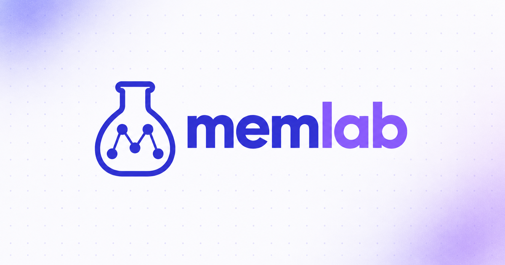
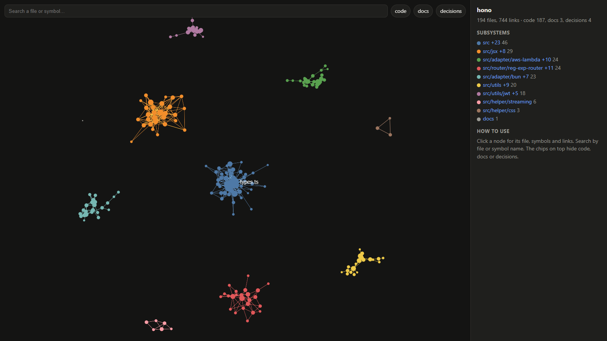
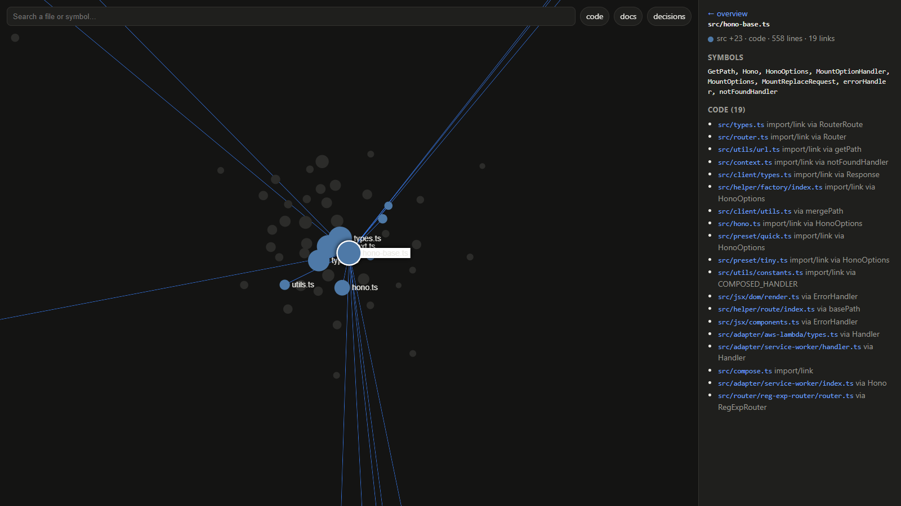
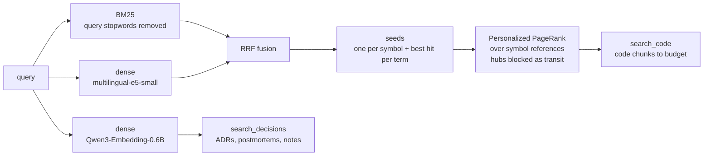

<p align="center">
  
</p>

<p align="center">
  <a href="LICENSE"></a>
  
  
  
  <a href="docs/RESEARCH.md"></a>
</p>

**Project memory for coding agents.** memlab gives Claude Code, Cursor or any MCP client two
things a plain vector index gets wrong: *the code a change actually touches*, and *the decisions
behind it*. It builds a symbol graph of your repository, ranks code with graph-aware retrieval,
keeps ADRs and postmortems in their own channel, and draws the whole project as an interactive map.

- **Measured, not claimed.** On ten evaluation sets from four real repositories memlab finds the
  right files more often than [graphify](https://github.com/Graphify-Labs/graphify) on every set,
  and retrieves past decisions where both graphify and AMG return almost nothing
  ([benchmarks](#benchmarks)). Every hypothesis was committed with its criteria before its run.
- **Local.** Code and docs never leave your machine: regex-based chunking, BM25, and two
  small open embedding models (CUDA if you have it, CPU otherwise). No LLM calls at index or query time.
- **Two tools, not one blend.** Mixing code and decisions into one ranking lost in every
  experiment; the agent asks for the kind of context it needs.

<p align="center">
  
  <br/><sub>The <a href="https://github.com/honojs/hono">Hono</a> codebase in memlab's <code>graph.html</code>: 23 subsystems, hubs sized by links.</sub>
</p>

## Quick start

```bash
pip install git+https://github.com/sattva2020/memlab      # Python 3.11+
cd /path/to/repo
memlab explore all --root .        # -> ~/.memlab/out/<repo>/graph.html and REPORT.md
```

For a GPU, install the CUDA build of PyTorch first (pip otherwise brings the CPU one); memlab
uses CUDA when it is there, Apple's GPU (MPS) on a Mac, and the CPU otherwise. The re-ranker runs on
CUDA only. On macOS and Linux the interpreter is often `python3`: use it wherever this page says `python`.

Checks without GitHub Actions: `scripts/ci-linux.sh user@docker-host` runs the tests and the plugin
validation in a `python:3.11` container on a Docker host; `codemagic.yaml` does the same on a Mac
(Apple Silicon), plus one embedding on MPS.

Connect it to your agent — add to the repository's `.mcp.json`:

```json
{
  "mcpServers": {
    "memlab": { "type": "stdio", "command": "memlab", "args": ["serve", "--root", "."] }
  }
}
```

### Claude Code plugin

The repository is also a Claude Code plugin: the MCP server, session hooks and three commands in
one install.

```
/plugin marketplace add sattva2020/memlab
/plugin install memlab@memlab
```

At install it asks for the Python interpreter (required); point it at the one you
installed memlab's dependencies into (`pip install numpy scipy networkx sentence-transformers`).
You get:

- `/memlab:status` — which tree is indexed, errors, decision notes at risk, a live search check
- `/memlab:recall <topic>` — prior decisions and the relevant code, with `path:line` sources
- `/memlab:note` — drafts this session's decisions as `docs/notes/`, written after you pick
- hooks: the newest decision records at session start (and, in a git worktree, a reminder to pass
  the worktree as `root`), a one-line hint on long prompts when memlab has not been used, and at
  session end `logs/usage.jsonl`: per search, the shown files the session then edited

Caches and logs go to the plugin's data folder. Do not also keep the `.mcp.json` entry above, or
two servers start.

In git worktree sessions of the Claude desktop app the server indexes the main checkout. The
`memlab-root` mod (Claude Code 2.1.287+) adds the session's worktree as `root` to every memlab call
and shows a status line; it works with the plugin or with the `.mcp.json` setup:

```
/plugin install memlab-root@memlab
```

No config file is needed. memlab reads the Dart package from `pubspec.yaml` and import aliases
from `tsconfig.json`, skips lockfiles and generated code, and treats `docs/adr/`,
`docs/decisions/`, `docs/postmortems/` and `docs/notes/` as decision memory. To change any of
that, put the section into `.memlab.toml` at the repository root (see `projects/example.toml`).

The two embedding models and the re-ranker (about 2.6 GB of VRAM together) are loaded once per
machine, in a small background process on 127.0.0.1 that every session shares and that exits
after 30 idle minutes. Without a GPU there is no re-ranking; `MEMLAB_RERANK=0` turns it off. Caches and the call
journal (`logs/calls.jsonl`) live in `~/.memlab` (set `MEMLAB_HOME` to move them).

Keep it fresh after every commit (runs in the background, never blocks a commit):

```bash
memlab hook-install --root /path/to/repo
```

## What you get

| | What it does |
|---|---|
| `search_code` | Files, classes and functions relevant to a task, with `path:line`. Code only; on a GPU the top 50 are re-ordered by a multilingual cross-encoder, so a question in Russian finds English code. |
| `search_decisions` | ADRs, postmortems and session notes that explain *why* — one best passage per document. |
| `add_note` | Records a decision as a new file in `docs/notes/` (never edits one, so worktrees merge cleanly); searchable at once. |
| `explain` | A symbol or file: where it is defined, who uses it, what it uses, linked docs and decisions. |
| `find_path` | The shortest chain of imports and symbol references between two files or symbols. |
| `graph.html` | One self-contained page: subsystems (Louvain), search, click a file for its symbols and neighbours, deep links (`graph.html#src/hono.ts`). |
| `REPORT.md` | Hubs, subsystems, surprising cross-folder links, hubs no document explains. |
| post-commit hook | Rebuilds the views and warms the index; only changed chunks are re-embedded. |

<p align="center">
  
  <br/><sub>Click a file: its symbols, and every file it imports or shares a symbol with — and through which name.</sub>
</p>

## How it works



- **Chunks** are cut at top-level declarations (code) and headings (markdown).
- **Edges** come from the source, no LLM: Dart and TS/JS imports, markdown links and backticked
  paths, and *symbol references* — a chunk that mentions a name defined elsewhere. Names defined
  in more than 3 places or mentioned in more than 200 chunks are dropped (they are noise).
- **Hubs don't leak**: in PageRank, a node with very high degree keeps the mass it receives but
  does not pass it on — the fix that made the graph beat flat retrieval (H5 in the research log).

## Benchmarks

Share of the right files in the top 5 results (files@5); ten sets, four repositories, the same
cases for every system. graphify 0.9.70 with its semantic document pass (gpt-4.1-mini);
AMG as deployed, run through its own retriever.

| set | memlab | AMG | graphify |
|---|---|---|---|
| natural-language questions, Flutter app (48) | **0.57** | 0.45 | 0.37 |
| change → files, Flutter app (80) | **0.59** | 0.28 | 0.29 |
| change → files, NestJS/Next.js CRM (80) | **0.57** | 0.09 | 0.08 |
| change → files, Node bot (25) | 0.30 | 0.01 | **0.40** |
| change → files, TS indexer (22) | 0.56 | **0.62** | 0.41 |
| decisions, 5 sets (192) | **0.93–1.00** | 0.00–0.04 | 0.00–0.05 |

memlab is ahead of graphify on all ten sets by the pre-registered rule (not significantly worse
anywhere, significantly better somewhere; paired bootstrap, 95% CI) — including the Node bot,
where graphify leads at files@5 but memlab leads at files@10 and @20. Full tables, token-budget
results, the failed hypotheses and the caveats: [docs/RESEARCH.md](docs/RESEARCH.md).

The evaluation sets are mined from private repositories (commit subjects → changed files, and
decision questions written blind by separate agents), so they are not published;
`memlab cases-from-git` builds the same kind of set from any repository.

## Commands

```bash
python -m memlab serve   --config C --root R                 # MCP server (stdio)
python -m memlab explore all|html|report --config C --root R # graph.html + REPORT.md
python -m memlab explore explain NAME    --config C --root R
python -m memlab explore path A B        --config C --root R
python -m memlab hook-install --config C --root R            # post-commit refresh
python -m memlab warm    --config C --root R                 # build the index once
python -m memlab cases-from-git --config C --out cases.json  # evaluation cases from history
python -m memlab eval    --config C --cases cases.json --methods "hybrid,only:code:ppr:refs:transit=1&seeds=gfy"
```

## Limits

- Import resolution covers Dart and TypeScript/JavaScript; other languages (Python included)
  are linked only through symbol references, so their graphs are sparser.
- Tuned and evaluated on English and Russian text.
- The first index build takes about a minute on a mid-size repository (models load, every chunk
  is embedded once); later builds re-embed only what changed.

## Research

memlab started as a replication-minded study of project memory for agents: does any structured
memory beat a well-tuned flat hybrid retriever at a matched token budget? The answer is "sometimes,
and here is exactly when" — ten stages, more than a dozen pre-registered hypotheses, results as they came
out: [docs/RESEARCH.md](docs/RESEARCH.md). Related work: [docs/related-work.md](docs/related-work.md).

## License

[Apache License 2.0](LICENSE). See [NOTICE](NOTICE).
